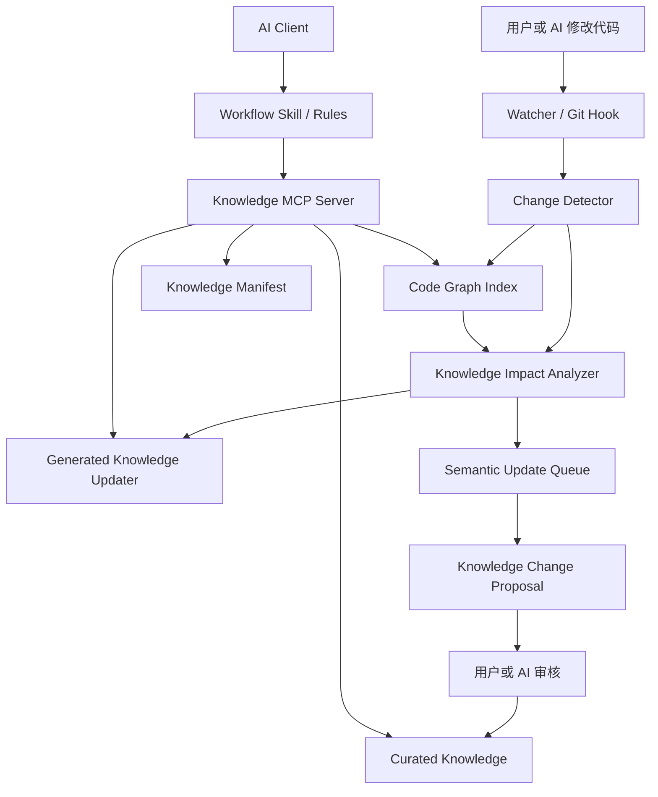

# 项目知识系统（PKS）设计

> 文档状态：Draft  
> 创建日期：2026-08-06  
> 目标读者：产品设计者、架构师、核心开发者、AI 工具集成开发者  
> 暂定产品名：Project Knowledge System（下文简称 PKS）

## 1. 摘要

PKS 是一个可安装、可初始化、可持续演进的项目级知识系统。它在目标代码仓库中建立一份可版本化的项目知识库，并在代码持续修改、功能增加和架构演进时自动维护代码事实、识别知识影响、生成语义知识变更提案。

PKS 的目标不是把整个代码仓库重复转换成大量 Markdown，也不是让 AI 完全不读代码。它要实现的是：

1. 不同 AI 客户端进入项目后都能快速获得一致的项目背景。
2. AI 不再每次从零扫描整个代码仓库，而是先检索知识，再读取少量相关源码。
3. 可从代码确定的知识自动、实时更新。
4. 无法仅从代码确定的业务语义和设计意图，以可追踪、可审核的提案方式更新。
5. 所有知识都有来源、版本、新鲜度和可信度，避免 AI 将过期推断当成事实。

推荐的产品形态是：

```text
PKS = 独立 CLI
    + Knowledge MCP Server
    + 代码结构索引引擎
    + 文件监听与增量更新器
    + AI Workflow Skill
    + Codex Plugin 适配层
    + 其他 AI 客户端适配层
```

核心能力必须独立于某一种 AI 产品。Codex Plugin、Skill、Claude 配置和 Cursor Rules 都只是适配层，不是知识库本体。

## 2. 背景与问题

### 2.1 当前问题

AI 在陌生或大型项目中完成开发任务时，通常要重复执行：

```text
列出目录
-> 搜索关键字
-> 阅读多个文件
-> 手工推导调用链
-> 猜测扩展点
-> 尝试修改
-> 通过报错修正理解
```

这种方式存在以下问题：

- 每个新会话都会重复理解同一套项目结构。
- 不同 AI 对同一项目形成的理解不一致。
- 搜索结果能找到相似文本，但不一定能回答真实调用关系。
- 代码能表达“如何实现”，却经常不能表达“为什么这样设计”。
- 静态文档容易过期，过期文档又会误导 AI。
- 直接把整个仓库放入上下文，成本高且噪声大。
- 仅使用向量检索无法可靠回答调用者、影响范围和覆盖测试。

### 2.2 产品机会

项目知识可以分成两类：

1. **可计算事实**：符号、调用、继承、路由、配置、数据模型、测试映射、文件依赖。
2. **语义知识**：模块职责、业务规则、架构原则、扩展方式、设计原因、经验与陷阱。

第一类可以由解析器和索引器自动维护；第二类必须结合代码变化、任务意图和审核流程维护。PKS 将两类知识统一到同一个检索入口中，但不会混淆它们的可信等级。

## 3. 产品愿景

安装 PKS 后，用户可以在任意项目中执行：

```bash
project-kb init
```

系统完成首次分析并生成项目知识库。此后，用户和 AI 正常修改代码，PKS 自动同步代码事实、标记受影响知识，并在一个完整变更形成后生成知识更新提案。

后续任意支持 MCP 的 AI 可以询问：

```text
我要为这个项目增加短信登录，应该从哪里开始？
```

PKS 应返回一个紧凑、带来源的任务上下文，包括：

- 认证模块职责与边界；
- 当前登录工作流；
- 可复用扩展点；
- 相关源码符号与调用链；
- 必须保持的业务不变量；
- 可参考的已有实现；
- 受影响测试与验证命令；
- 相关知识的新鲜度和可信等级。

## 4. 目标与非目标

### 4.1 产品目标

- 一条命令初始化项目知识库。
- 支持中大型、长期维护的代码仓库。
- 代码事实随文件变化增量更新。
- 文档与代码之间存在可查询的来源映射。
- 知识检索默认返回任务相关的最小上下文。
- 支持 Codex、Claude Code、Cursor 等多个 AI 客户端。
- 核心功能本地运行，不强制上传源码。
- 支持 Git 分支、工作树和多人协作。
- 自动检测知识过期，而不是假设文档永远正确。
- 通过评测量化检索正确率、上下文节省和知识新鲜度。

### 4.2 非目标

- 不取代编译器、LSP、测试套件或代码评审。
- 不承诺从代码自动恢复完整业务意图。
- 不在每次文件保存后调用大模型重写全部文档。
- 不把代码全文复制成另一套 Markdown。
- 不以向量相似度替代结构化调用图。
- 不在第一版提供自动修改业务规则和 ADR 的能力。
- 不要求所有 AI 客户端支持同一种 Skill 格式。

## 5. 核心设计原则

### 5.1 事实与推断分离

系统必须明确区分：

- 从代码直接提取的事实；
- 通过静态分析解析的关系；
- AI 根据上下文推断的结论；
- 人工确认的项目知识。

任何推断都不能伪装成已确认事实。

### 5.2 来源可追踪

每条知识必须能追踪到以下来源中的至少一种：

- 文件与行号；
- 符号 ID；
- Git commit；
- 配置或 Schema；
- 用户任务描述；
- 已审核设计决策。

### 5.3 渐进式披露

AI 首先得到知识索引和任务摘要，只在需要时读取详细文档和源码。禁止默认向上下文灌入整个知识库。

### 5.4 自动化程度与可信度匹配

- 确定性事实允许自动覆盖。
- 可重复计算的派生知识允许自动更新。
- 语义知识只生成提案。
- 设计决策默认追加，不静默改写历史。

### 5.5 Git 是协作基线

需要团队共享、审核和回滚的知识必须以文本形式进入 Git。可重建的本地索引不提交 Git。

### 5.6 核心独立于客户端

CLI、索引、知识模型和 MCP Server 是核心。Plugin、Skill 和客户端规则均为可替换适配器。

## 6. 总体架构



系统分为六个核心子系统：

1. 安装与客户端集成。
2. 项目初始化与扫描。
3. 代码结构索引。
4. 知识生成、存储与新鲜度管理。
5. MCP 查询与上下文组装。
6. 增量更新与知识变更提案。

## 7. 产品交付形态

### 7.1 Core CLI

独立可执行程序，负责：

- 项目初始化；
- 全量和增量索引；
- 文件监听；
- 知识生成；
- 状态检查；
- 客户端安装；
- CI 校验。

### 7.2 Knowledge MCP Server

向 AI 暴露稳定、少量、面向任务的查询工具。MCP 是跨客户端的主要运行时协议。

### 7.3 Workflow Skill

Skill 只负责规定 AI 的使用流程，不保存唯一一份项目知识。它应指导 AI：

1. 任务开始时调用知识上下文接口。
2. 修改前查询调用链和影响范围。
3. 修改后执行验证。
4. 功能完成后提交任务意图和知识变化摘要。
5. 不确定或知识过期时读取实时源码。

### 7.4 Codex Plugin

Codex Plugin 作为安装包，包含：

```text
project-knowledge-plugin/
├── .codex-plugin/plugin.json
├── skills/
├── hooks/
├── scripts/
├── .mcp.json
└── assets/
```

### 7.5 其他客户端适配器

安装器可以按平台写入最小配置：

- `AGENTS.md` 标记区块；
- `CLAUDE.md` 标记区块；
- Cursor rules；
- Gemini CLI 配置；
- MCP Server 注册信息。

适配器只写引用和工作协议，不复制项目知识。

## 8. 项目内目录设计

初始化后建议创建：

```text
.project-kb.yml
.project-kb/
├── index.db
├── manifest.json
├── state.json
├── events/
├── proposals/
└── logs/

docs/knowledge/
├── index.md
├── generated/
│   ├── project-map.md
│   ├── modules/
│   ├── workflows/
│   ├── routes.md
│   ├── data-model.md
│   └── test-map.md
├── curated/
│   ├── architecture.md
│   ├── conventions.md
│   ├── glossary.md
│   ├── modules/
│   ├── workflows/
│   └── recipes/
└── decisions/
    └── 0001-example.md
```

默认 Git 策略：

| 内容 | 是否提交 Git | 原因 |
| --- | --- | --- |
| `.project-kb.yml` | 是 | 团队共享配置 |
| `docs/knowledge/**` | 是 | 可审核、可版本化知识 |
| `.project-kb/index.db` | 否 | 可重建且与本地工作树绑定 |
| `.project-kb/logs/` | 否 | 本地运行数据 |
| `.project-kb/proposals/` | 可配置 | 可选择进入 PR 审核 |
| `.project-kb/manifest.json` | 建议是 | 保存文档与源码映射；不得含绝对路径 |

## 9. 知识分层

### 9.1 Generated Knowledge

由确定性分析产生，可以自动覆盖：

- 项目语言与框架；
- 目录和模块地图；
- 符号定义；
- 导入与调用关系；
- 接口和实现关系；
- Web 路由到处理器映射；
- 数据模型和迁移；
- 配置项清单；
- 测试文件映射；
- 可静态识别的主要执行路径。

生成文件应明确写明：

```text
This file is generated. Do not edit manually.
```

### 9.2 Curated Knowledge

由人或 AI 审核维护：

- 模块职责和边界；
- 业务不变量；
- 推荐扩展点；
- 开发规范；
- 操作 Recipe；
- 安全与性能约束；
- 已知陷阱；
- 领域术语。

自动化系统不得直接覆盖人工段落。需要局部自动更新时，应使用明确的 generated block：

```markdown
<!-- project-kb:generated id="auth-entrypoints" -->
...
<!-- /project-kb:generated -->
```

### 9.3 Decisions

设计决策采用 ADR。默认追加新 ADR，不修改已接受决策的历史内容。废弃旧决策时创建新 ADR，并声明替代关系。

## 10. 知识记录模型

每条知识在 Manifest 中对应一个结构化记录：

```yaml
id: workflow.auth.login
kind: workflow
title: 用户登录流程
path: docs/knowledge/curated/workflows/user-login.md
ownership: curated
confidence: verified
status: fresh
sources:
  - type: symbol
    id: AuthController.login
  - type: symbol
    id: AuthService.authenticate
  - type: file
    path: src/auth/token_service.lua
source_commit: abc123
source_hashes:
  AuthController.login: sha256:...
last_generated_at: 2026-08-06T10:00:00+08:00
last_verified_at: 2026-08-06T10:30:00+08:00
supersedes: []
tags:
  - authentication
  - security
```

### 10.1 可信等级

| 等级 | 含义 | 默认使用策略 |
| --- | --- | --- |
| `verified` | 人工或受控流程确认 | 可作为主要依据 |
| `generated` | 可从源码确定性生成 | 可作为代码事实 |
| `inferred` | AI 或启发式推断 | 必须附带提示和来源 |
| `stale` | 关联源码已变化 | 不得单独作为修改依据 |
| `conflicted` | 文档与源码或其他知识冲突 | 必须先核实 |

### 10.2 新鲜度判定

知识是否过期不只根据日期判断，而根据来源变化判断：

```text
当前来源哈希 == 记录来源哈希 -> fresh
当前来源哈希 != 记录来源哈希 -> potentially_stale
来源符号已删除或无法解析 -> stale
多个权威来源互相冲突 -> conflicted
```

## 11. 初始化流程

### 11.1 命令

```bash
project-kb init [path]
```

### 11.2 初始化阶段

#### 阶段 A：环境检查

- 定位仓库根目录；
- 检查 Git 状态；
- 识别分支和工作树；
- 检查已有 PKS 数据；
- 读取 `.gitignore`；
- 检查文件规模和语言分布；
- 检查本地解析引擎可用性。

#### 阶段 B：项目识别

- 检测语言、框架和包管理器；
- 识别构建、测试、格式化命令；
- 识别服务入口、路由、任务调度器和消息消费者；
- 识别数据库 Schema、迁移和配置文件；
- 识别已有 README、ADR、规范和 API 文档。

#### 阶段 C：结构索引

- 解析文件；
- 提取符号；
- 建立导入、调用、继承和实现边；
- 执行框架感知解析；
- 建立全文检索索引；
- 记录解析失败和低置信关系。

#### 阶段 D：知识草案

- 生成项目地图；
- 聚类或识别模块；
- 提取核心入口；
- 生成可静态确定的工作流；
- 建立测试映射；
- 为 Curated Knowledge 创建待完善模板；
- 对从源码无法确认的结论标记为 `inferred`。

#### 阶段 E：集成

- 创建 `.project-kb.yml`；
- 写入 `.gitignore` 规则；
- 在 AI 规则文件中添加 marker-fenced 指引；
- 注册 MCP Server；
- 启动或提示启动 watcher；
- 输出初始化报告。

### 11.3 初始化结果报告

至少包含：

- 扫描文件数；
- 解析成功率；
- 语言和框架；
- 符号、关系和模块数量；
- 已生成知识页；
- 未解决引用数量；
- 低置信工作流；
- 排除路径；
- 建议人工确认的问题。

## 12. 增量更新流程

### 12.1 变更触发源

- 文件系统 watcher；
- AI 工具生命周期 hook；
- Git `post-checkout`；
- Git `post-merge`；
- Git `pre-commit` 或 CI 检查；
- 用户手动执行 `project-kb sync`；
- MCP Server 连接时的补偿同步。

### 12.2 文件保存级更新

文件保存后仅执行低成本、确定性更新：

```text
文件事件
-> 防抖与事件合并
-> 内容哈希比较
-> 增量 AST 解析
-> 替换相关符号和边
-> 计算影响范围
-> 更新 Generated Knowledge
-> 标记 Curated Knowledge 新鲜度
```

不得在每次保存时调用大模型生成语义文档。

### 12.3 变更批次级更新

一次完整功能、提交或显式同步形成 `ChangeSet`：

```yaml
id: change-20260806-001
base_commit: abc123
head_commit: def456
task_summary: 增加短信验证码登录
changed_files: []
changed_symbols: []
affected_modules: []
affected_knowledge: []
tests_run: []
test_results: []
author: ai-or-user
```

系统使用 ChangeSet 生成知识变化提案，而不是全量重写知识库。

### 12.4 Git 切换与 Rebase

检测到 HEAD、分支或工作树变化时：

1. 暂停普通增量队列；
2. 对比索引基线与当前工作树；
3. 对变化文件执行补偿同步；
4. 重新计算知识新鲜度；
5. 必要时作废尚未应用的提案。

每个 Git worktree 必须拥有独立索引，不能共享一个反映不同提交状态的数据库。

## 13. 语义知识更新

### 13.1 为什么不能静默全自动

代码变化无法可靠表达：

- 需求为什么发生变化；
- 临时兼容逻辑是否是长期设计；
- 某个约束是业务要求还是实现偶然；
- 被删除的行为是废弃还是迁移；
- 新增 API 是否应该成为推荐扩展方式。

因此，语义更新必须输出差异提案。

### 13.2 提案生成输入

- 代码 diff；
- 变更前后的结构图；
- 受影响知识条目；
- 用户原始任务描述；
- 执行该任务的 AI 总结；
- 测试结果；
- 提交信息和关联 Issue；
- 已有 ADR 和业务不变量。

### 13.3 提案输出

```yaml
proposal_id: kp-20260806-001
target: docs/knowledge/curated/workflows/user-login.md
reason: 登录流程增加短信验证码分支
evidence:
  - src/auth/sms_provider.lua
  - AuthService.authenticate
confidence: 0.86
operations:
  - add_section
  - update_source_reference
requires_review: true
```

### 13.4 应用策略

- `generated` 文件可以自动应用；
- generated block 可以自动应用；
- curated 人工段落生成 Patch，默认等待审核；
- ADR 只生成新文件草案；
- 删除知识必须提供来源删除和替代路径证据；
- 低置信提案不得自动进入 Git。

## 14. 检索与上下文组装

### 14.1 查询流程

```text
用户任务
-> 意图与领域识别
-> 检索 Curated Knowledge
-> 检索 Generated Knowledge
-> 定位代码图锚点
-> 扩展调用链和影响范围
-> 检查新鲜度与冲突
-> 按 Token 预算组装上下文
-> 返回来源和缺口
```

### 14.2 混合检索

建议使用：

- 文档标题、标签和正文的 FTS/BM25；
- 可选的文档向量检索；
- 符号和路径精确搜索；
- 代码图遍历；
- 任务类型和模块过滤；
- 新鲜度和可信度加权。

向量检索主要用于 Markdown、ADR、Issue 摘要和业务术语，不用于代替调用关系解析。

### 14.3 排序建议

初始相关度可表示为：

```text
score = text_relevance
      + graph_proximity
      + module_match
      + task_type_match
      + confidence_weight
      + freshness_weight
      - staleness_penalty
```

具体权重必须通过离线评测确定，不应在第一版过度设计。

### 14.4 返回格式

每个上下文片段应携带：

- 内容摘要；
- 知识类型；
- 可信等级；
- 新鲜度；
- 来源；
- 相关符号；
- 建议下一步；
- 是否需要读取实时源码。

## 15. MCP 接口设计

第一版建议只暴露五个工具。

### 15.1 `knowledge_context`

主要入口，根据任务返回综合上下文。

```json
{
  "task": "增加短信验证码登录",
  "projectPath": "D:/work/server/gardenserver",
  "maxTokens": 6000
}
```

### 15.2 `knowledge_search`

搜索文档、模块、工作流、Recipe 和 ADR。

```json
{
  "query": "认证扩展方式",
  "kinds": ["module", "workflow", "recipe", "decision"],
  "module": "auth",
  "limit": 10
}
```

### 15.3 `knowledge_get`

按稳定 ID 读取单条知识及来源状态。

### 15.4 `knowledge_impact`

查询文件或符号变化影响到的模块、工作流、测试和知识页。

### 15.5 `knowledge_status`

返回索引状态、待同步文件、过期知识、冲突和待审核提案。

### 15.6 写操作策略

MVP 的 MCP 默认只读。初始化、重建和批量应用提案通过 CLI 完成。

需要 AI 写入时，后续可以增加：

```text
knowledge_record_change
knowledge_propose_update
```

这两个接口只记录事件或生成 Patch，不直接静默覆盖 Curated Knowledge。

## 16. CLI 设计

```bash
project-kb install                 # 安装客户端集成
project-kb init [path]             # 初始化项目
project-kb sync [path]             # 增量同步
project-kb rebuild [path]          # 重建索引和生成知识
project-kb watch [path]            # 持续监听
project-kb status [path]           # 状态和健康检查
project-kb check [path]            # CI 校验
project-kb propose [range]         # 生成知识更新提案
project-kb apply <proposal-id>      # 应用已审核提案
project-kb reject <proposal-id>     # 拒绝提案并记录原因
project-kb doctor                   # 检查安装与客户端连接
project-kb uninstall               # 删除集成，默认保留项目知识
```

所有写操作都应支持：

```text
--dry-run
--json
--quiet
```

初始化和重建必须使用临时文件或事务，失败时保留旧的可用索引。

## 17. Skill 行为规范

Skill 的建议触发场景：

- 解释项目架构；
- 实现新功能；
- 修复跨模块缺陷；
- 修改公共接口；
- 进行重构或代码评审；
- 更新项目知识库。

标准流程：

```text
1. 调用 knowledge_status。
2. 如果索引严重过期，先请求同步或读取实时文件。
3. 调用 knowledge_context 获取任务上下文。
4. 修改前调用 knowledge_impact。
5. 只读取必要源码。
6. 实现并运行项目规定的验证。
7. 记录任务意图、测试结果和架构影响。
8. 需要时生成知识更新提案。
9. 最终回复中报告知识库是否更新或仍待审核。
```

## 18. 代码结构引擎策略

### 18.1 短期策略

MVP 不自行重写完整的多语言代码图引擎。优先定义抽象接口：

```text
CodeIndexEngine
├── initialize(project)
├── sync(changedFiles)
├── searchSymbols(query)
├── getSource(symbol)
├── trace(from, to)
├── impact(symbols)
├── affectedTests(files)
└── status()
```

第一版可以使用 `colbymchenry/codegraph` 作为实时结构查询底座，并参考 `tirth8205/code-review-graph` 的 Wiki、社区分析、跨仓库和审查能力。

### 18.2 集成约束

- 优先使用公开 CLI 或程序 API，不直接依赖未承诺稳定的 SQLite Schema。
- 适配层必须允许以后更换索引引擎。
- 引擎输出关系时必须保留置信度。
- 对动态分派、反射和依赖注入必须明确报告静态分析边界。
- LSP 可以作为高精度补充，但不是 MVP 必需依赖。

## 19. 配置设计

`.project-kb.yml` 示例：

```yaml
version: 1

project:
  name: gardenserver

index:
  engine: codegraph
  include:
    - src/**
    - src_dev/**
    - config/**
  exclude:
    - vendor/**
    - generated/**

knowledge:
  root: docs/knowledge
  generated: docs/knowledge/generated
  curated: docs/knowledge/curated
  decisions: docs/knowledge/decisions

updates:
  watch: true
  debounce_ms: 1000
  generated_mode: auto
  curated_mode: proposal
  proposal_trigger: commit

retrieval:
  max_tokens: 6000
  embeddings: disabled

privacy:
  local_only: true
  telemetry: false
```

配置 Schema 必须版本化，并提供向前迁移命令。

## 20. 一致性与并发

- SQLite 使用 WAL 或等效读写并发机制。
- 同一项目只允许一个写入协调者。
- 多个 AI 客户端共享后台 daemon，避免重复 watcher 和重复索引。
- MCP 查询应读取一致快照。
- 写入期间继续提供上一份有效索引，完成后原子切换。
- 进程异常退出后能够清理过期锁并恢复。
- 文件索引时再次发生修改，必须检测哈希不一致并重新排队。

## 21. 安全与隐私

### 21.1 默认策略

- 核心索引、检索和生成知识在本地完成。
- 默认不启用云端 Embedding 或 LLM。
- 不收集源码、路径、符号名和查询内容遥测。
- 项目索引不得包含可发布的绝对路径。
- 敏感配置值只记录键名、类型和来源，不记录 Secret 值。

### 21.2 云能力

启用云端 Embedding 或 LLM 时必须：

- 显式选择 Provider；
- 明确展示将发送的字段；
- 支持 `--dry-run` 预览数据；
- 对 Secret 和高风险路径进行脱敏；
- 记录 Provider、模型和生成版本；
- 支持完全关闭网络访问。

### 21.3 MCP 写权限

MVP 默认只读。后续写工具必须区分：

- 记录事件；
- 生成提案；
- 应用 generated 内容；
- 修改 curated 内容。

最后一类默认需要用户确认或受控策略授权。

## 22. 可观测性

`project-kb status` 至少显示：

- 当前索引对应的 commit 和工作树状态；
- 文件、符号和关系数量；
- 上次全量索引和增量同步耗时；
- 待处理文件；
- 解析错误；
- 过期和冲突知识数量；
- 待审核提案数量；
- 数据库大小；
- watcher 和 daemon 状态；
- 最近 MCP 查询的上下文大小统计。

日志必须区分：

```text
index
sync
knowledge-generation
proposal
retrieval
mcp
integration
```

## 23. 性能目标

MVP 建议目标：

| 指标 | 目标 |
| --- | --- |
| 500 文件项目首次初始化 | 30 秒内，不含可选 LLM |
| 5,000 文件项目首次初始化 | 5 分钟内 |
| 单文件增量结构同步 | P95 小于 2 秒 |
| `knowledge_status` | P95 小于 200 ms |
| `knowledge_search` | P95 小于 500 ms |
| `knowledge_context` 本地组装 | P95 小于 2 秒 |
| 文件保存期间错误旧源码返回 | 0 |
| generated 知识来源覆盖率 | 100% |

这些指标需要在固定硬件和固定样本仓库上测量，不能只发布最优结果。

## 24. 测试与评测

### 24.1 单元测试

- 配置解析；
- Manifest Schema；
- 哈希和新鲜度计算；
- generated block 替换；
- ChangeSet 生成；
- Token 预算裁剪；
- Secret 脱敏；
- Git 状态转换。

### 24.2 集成测试

- 初始化真实小型仓库；
- 新增、修改、删除、重命名文件；
- 切换分支和 worktree；
- 同时启动多个 MCP 客户端；
- 索引过程中再次保存文件；
- 模拟进程崩溃和锁恢复；
- 生成并审核知识提案；
- 卸载集成但保留知识库。

### 24.3 检索评测集

每个样本项目准备带标准答案的问题：

- 某请求如何到达数据库；
- 某接口有哪些实现；
- 新增某功能应该使用哪个扩展点；
- 修改某符号影响哪些模块和测试；
- 某业务不变量定义在哪里；
- 某设计选择的原因是什么；
- 最近一次功能增加后哪些知识已经过期。

评测指标：

- 正确文件召回率；
- 正确符号召回率；
- 调用路径准确率；
- 错误关系数量；
- 知识过期检测召回率；
- 上下文 Token 数；
- AI 工具调用次数；
- 最终任务成功率；
- 生成文档需要人工修正的比例。

### 24.4 对照实验

至少比较：

1. 原生 grep + Read；
2. 只有代码图；
3. 只有 Markdown/RAG；
4. PKS 混合检索。

不能只使用“读取整个仓库”作为对照基线。

## 25. MVP 范围

### 25.1 MVP 必须实现

- `project-kb init`；
- `project-kb sync`；
- `project-kb status`；
- 文件监听和增量同步；
- Generated Knowledge；
- Manifest 与来源哈希；
- 知识新鲜度检测；
- `knowledge_context`；
- `knowledge_search`；
- `knowledge_impact`；
- `knowledge_status`；
- 一个 Codex Skill；
- 一个 Codex Plugin 安装包；
- `AGENTS.md` marker-fenced 集成；
- 本地只读 MCP；
- 基础评测工具。

### 25.2 MVP 暂不实现

- 自动应用 Curated Knowledge 改写；
- 多仓库统一知识图；
- 云端托管平台；
- UI 图谱编辑器；
- 自动合并冲突 ADR；
- 复杂权限系统；
- 全语言自研解析器；
- 默认启用向量数据库。

## 26. 迭代路线

### Phase 0：技术验证

- 验证 CodeGraph 集成；
- 验证结构索引和文档映射；
- 建立十到二十个标准问题；
- 测量原生搜索基线。

### Phase 1：可用 MVP

- 完成 CLI、MCP、Watcher 和 Plugin；
- 生成基础知识；
- 支持自动新鲜度检测；
- 在单仓库、单用户场景稳定运行。

### Phase 2：知识变更提案

- 引入 ChangeSet；
- 收集任务意图和测试结果；
- 生成 Curated Knowledge Patch；
- 提供审核和拒绝反馈闭环。

### Phase 3：团队与 CI

- PR 知识影响报告；
- 文档过期合并门禁；
- 团队共享配置；
- 评测报告；
- 多客户端安装器。

### Phase 4：跨仓库与高级检索

- 跨服务工作流；
- 多仓库知识注册表；
- 可选向量检索；
- Issue、内部文档和 Schema 连接器；
- 受控的知识自动接受策略。

## 27. MVP 验收标准

在至少一个 1,000 文件以上的真实项目中满足：

1. 全新安装后通过一条命令完成初始化。
2. 新会话中的 AI 能通过一个主要 MCP 调用获得项目任务上下文。
3. 修改文件后两秒内结构索引完成更新，或查询明确报告待同步文件。
4. 删除或重命名来源符号后，关联知识被标记过期。
5. Generated Knowledge 不需要人工维护。
6. Curated Knowledge 不会被后台进程静默覆盖。
7. 所有返回给 AI 的关键结论都包含来源和可信等级。
8. 与原生 grep + Read 基线相比，多文件架构问题的平均工具调用次数显著下降。
9. 不联网时核心初始化、同步和查询仍可工作。
10. 卸载集成不会删除用户已经维护的知识文档。

## 28. 主要风险与缓解措施

| 风险 | 影响 | 缓解措施 |
| --- | --- | --- |
| 静态分析漏掉反射和动态调用 | 影响分析不完整 | 置信度、框架适配、运行时证据、明确边界 |
| 自动 Wiki 产生错误结论 | AI 被误导 | generated/inferred 分层、来源、审核 |
| 文档频繁变化造成 Git 噪声 | 团队拒绝使用 | 只在批次或提交边界更新文档 |
| 多工具使 AI 选择困难 | 工具调用增多 | 默认只暴露少量任务级 MCP 工具 |
| watcher 漏事件 | 索引过期 | 连接时补偿同步、哈希校验、状态提示 |
| 分支切换污染索引 | 返回错误代码事实 | worktree 独立索引、HEAD 检测 |
| 云模型泄露代码或 Secret | 安全事故 | local-only 默认、脱敏、显式授权 |
| 索引引擎供应方变化 | 产品被锁定 | 抽象接口、避免耦合私有数据库 Schema |
| 知识库规模持续膨胀 | 检索和上下文恶化 | 生命周期、归档、去重和 Token 预算 |
| 用户忽略更新提案 | Curated Knowledge 过期 | CI 提醒、风险排序、低摩擦审核 |

## 29. 已确定的设计决策

1. 产品核心采用 CLI + MCP，而不是只有 Skill。
2. Codex 侧通过 Plugin 打包 Skill、Hook、脚本和 MCP 配置。
3. 项目知识保存在仓库中，AI 产品配置只保存引用和使用规则。
4. 代码事实允许自动更新，语义知识默认只生成提案。
5. MCP 默认提供少量高层工具，而不是大量原子工具。
6. 本地索引和 Git 文档分离。
7. 每条知识必须具备来源、可信等级和新鲜度。
8. 第一版复用现有代码图引擎，不自研完整多语言解析器。
9. 向量检索是可选增强，不是代码调用关系的事实来源。
10. 核心离线可用，云能力显式选择。

## 30. 待验证问题

以下问题需要在 Phase 0 通过原型和评测确定：

- 首选代码图引擎的程序 API 是否足够稳定；
- Lua、动态模块加载和项目自定义框架的解析覆盖率；
- Generated Knowledge 的最小有用集合；
- 最适合触发语义提案的时间点：任务结束、提交还是 PR；
- 任务意图如何跨不同 AI 客户端标准化记录；
- 是否提交 Manifest，及多人合并时的冲突成本；
- 不使用 Embedding 时，文档检索能否达到可接受效果；
- 哪些知识变化可以在团队策略下自动接受；
- Windows、WSL 和网络文件系统上的 watcher 可靠性；
- Plugin、独立安装器和各 AI 客户端配置的版本兼容策略。

## 31. 开发约束

后续开发必须遵守：

- 先建立评测集，再优化检索算法。
- 所有基准公开硬件、仓库版本、查询和失败样本。
- 不用未经验证的 Token 节省数据作为产品正确性证明。
- 不返回索引已知过期的源码片段；应读取实时文件或明确拒绝。
- 不自动覆盖用户手写知识。
- 不因某个客户端缺少 Skill 支持而破坏 MCP 核心能力。
- 不将索引数据库格式直接暴露为公共接口。
- 不在默认配置下把源码或源码派生文本发送到外部服务。
- 所有安装和卸载操作只修改本工具拥有的标记区块或文件。
- 卸载默认保留项目知识和用户修改。

## 32. 后续开发起点

第一轮开发不应从 UI 或自动写 Wiki 开始，而应依次完成：

1. 定义 `KnowledgeRecord`、`SourceReference`、`ChangeSet` 和 `Proposal` Schema。
2. 定义 `CodeIndexEngine` 抽象接口并实现 CodeGraph 适配器。
3. 实现 `init`、`sync`、`status` 三个 CLI 命令。
4. 生成 `project-map`、模块地图、路由和测试映射。
5. 实现来源哈希和新鲜度状态机。
6. 实现只读 MCP 的五个工具。
7. 编写薄 Skill 和 Codex Plugin 适配层。
8. 建立真实项目评测集并与 grep + Read 对照。
9. 验证 MVP 后再实现语义知识提案。

这一顺序保证系统首先具备可信、实时、可查询的代码事实，再逐步增加需要大模型判断的语义能力。

## 33. 参考项目

- [tirth8205/code-review-graph](https://github.com/tirth8205/code-review-graph)：参考 Wiki 生成、代码社区、风险审查、跨仓库和知识循环能力。
- [colbymchenry/codegraph](https://github.com/colbymchenry/codegraph)：参考实时结构索引、MCP 查询、调用链、影响分析和增量同步能力。

这些项目可以作为实现底座或设计参考，但 PKS 的核心差异是：将代码事实、项目语义、来源追踪、新鲜度和受控知识演进整合为一个完整生命周期。
